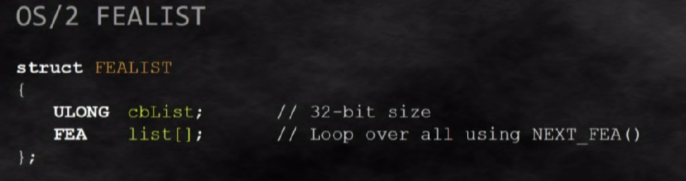

# Hack the box - Blue

首先，用nmap扫描靶机。

.PNG>)

搜一下 TCP/445 上运行的版本信息我们就会发现这台靶机上运行的就是大名鼎鼎的"Eternal Blue"永恒之蓝漏洞。因为永恒之蓝这个漏洞实在太出名了，metasploit上的攻击程序已经非常成熟了，而且中文互联网上也有很多类似的教程，我这里也就不再赘述如何用metasploit攻击靶机了。这篇文章主要想谈一谈这个漏洞的原理以及相应的攻击程序的运行原理。

## 漏洞1 Wrong Casting Bug

### OS/2 1.2 和 WINDOWS NT

对于这两个名词，我们并不一定需要知道太多。我们只要知道OS/2 1.2系统比较老，WINDOWS NT 作为一个文件系统比较新，win 10还在用ntfs系统。

微软作为一个操作系统的提供商需要向用户提供向下兼容（backward campatibility）的服务。当windows nt系统所用的文件系统需要和OS/2 1.2系统产生SMB链接的时候，一些数据是需要被转换的。这个被转换的数据呢，就是FEA list。

那么FEA list是什么东西呢？它的全名是File Extended Attributes List, 是存放文件信息的list函数。下面两张图就是OS/2 的FEA list和WINDOWS NT的FEA list。

.PNG>)

永恒之蓝利用的漏洞是当OS/2 1.2的客户发SMB请求到WINDOWS NT上时，WINDOWS NT会将OS/2 1.2中的ulong函数转换成ushort函数

.PNG>)
